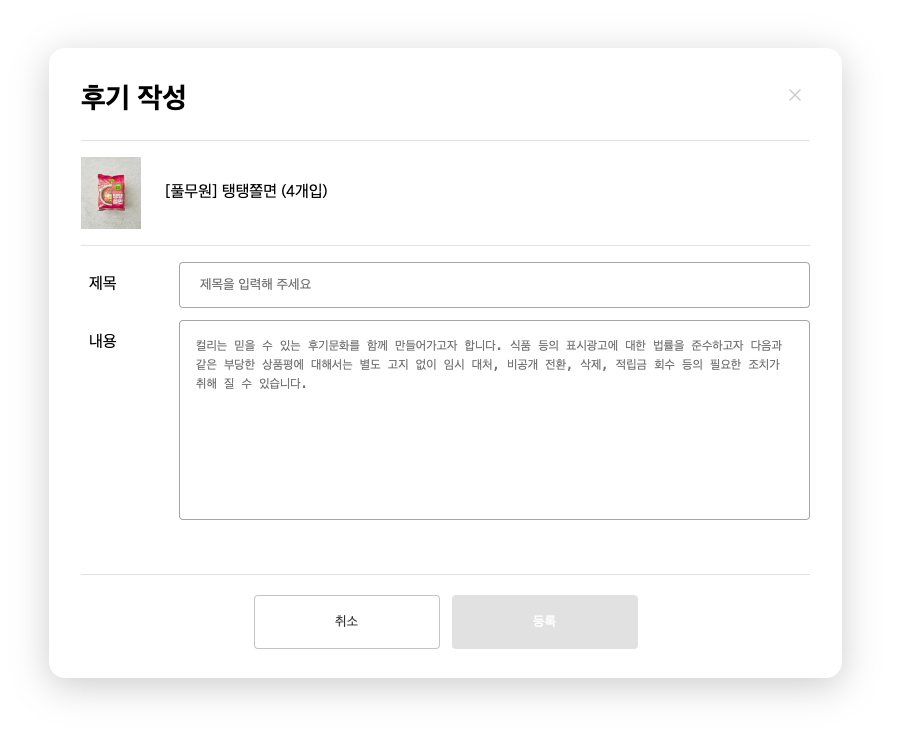
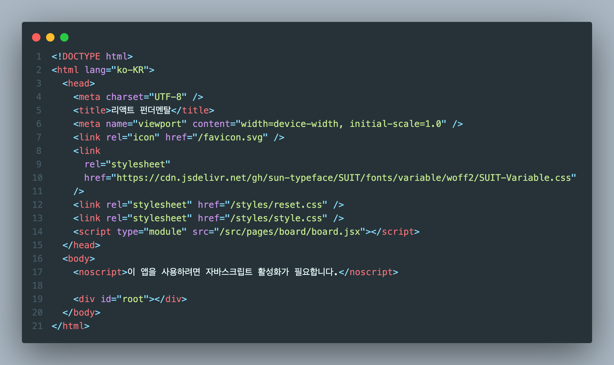
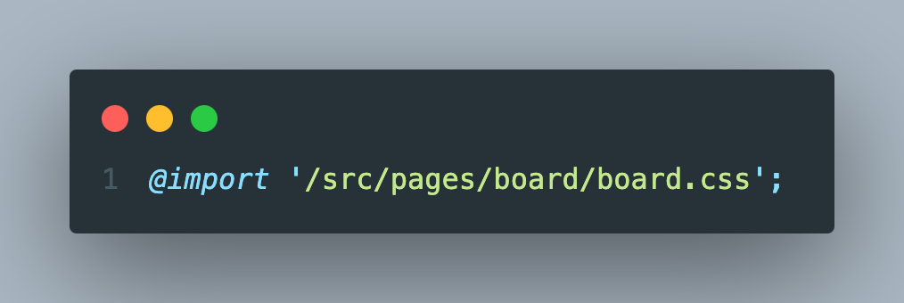
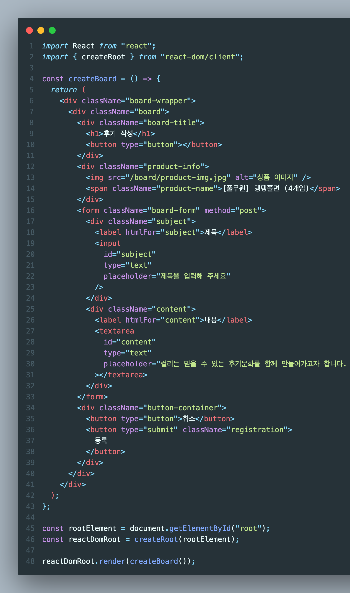

# 2024.01.20 / 과제 1

 

 

- [x] 바닐라 프로젝트에서 안 만들어본 부분 리액트로 해보기

 

## STEP 1 - HTML

 

- [x] index.html에 JSX 파일과 CSS 파일 연결
- [x] style.css에 각 컴포넌트 파일을 import 해서 불러옴
- [x] JSX 파일에서 불러온 내용은 root 안에 들어감

 

## STEP 2 - JSX

 

- [x] node.js에 설치한 react, react-dom 사용

* index.html의 root를

- [x] 1. 변수 rootElement에 담고
- [x] 2. react-dom의 createRoot 메서드를 통해 react 요소를 담을 수 있게 만듬
- [x] 3. reactDomRoot에 createBoard 함수의 내용을 렌더링

 
