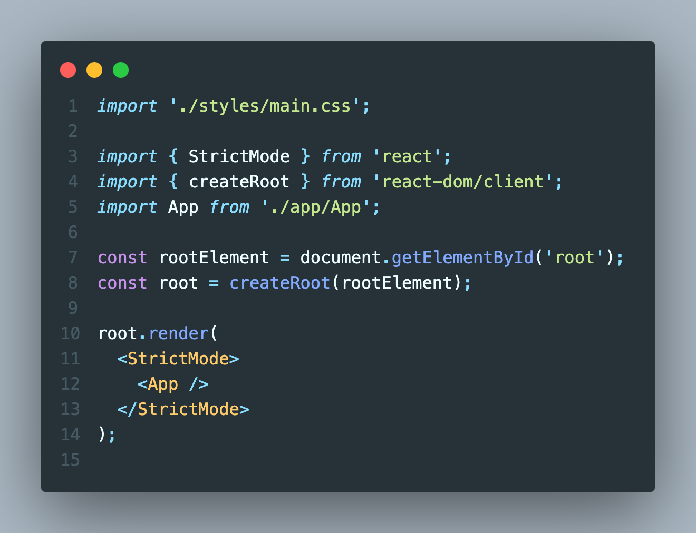

# 2024.01.27 / 과제 2

 

 

- [x] 바닐라 프로젝트에서 동적 렌더링했던 부분의 데이터를 JSON 파일로 저장하고 불러와 마크업에 연결하기

 

## STEP 1 - 렌더링 구조

 

- [x] App에 컴포넌트를 impmort해서 렌더링하는 방식으로 변경

 

## STEP 2 - 데이터, 컴포넌트

 

- [x] 불러올 데이터 JSON 파일 생성

 

 

- [x] data의 items 배열을 map 메서드로 객체 하나씩 분리
- [x] 구조분해할당을 사용하기 위해 변수로 만들고 데이터가 필요한 부분에 입력

 
